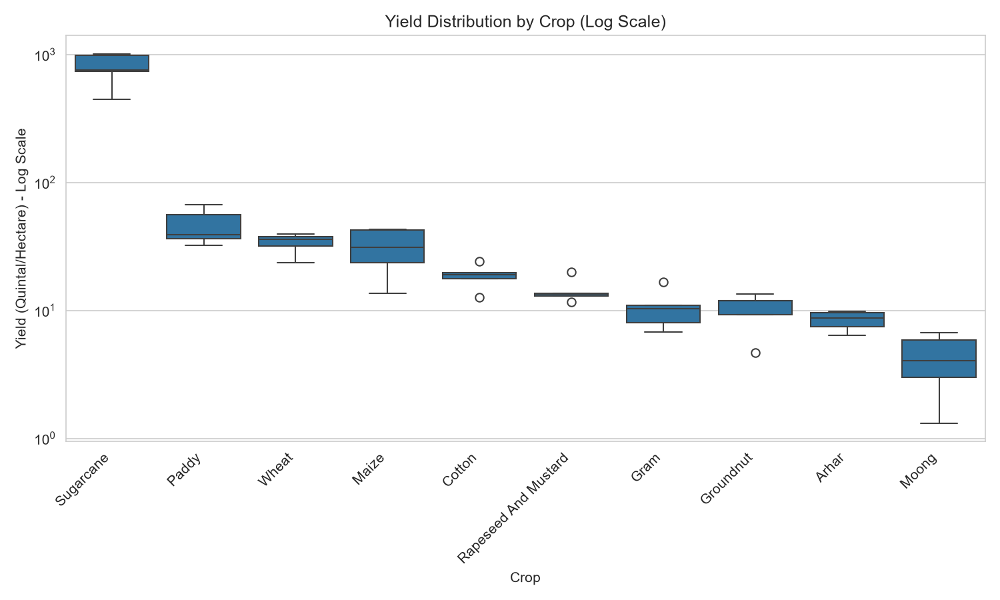
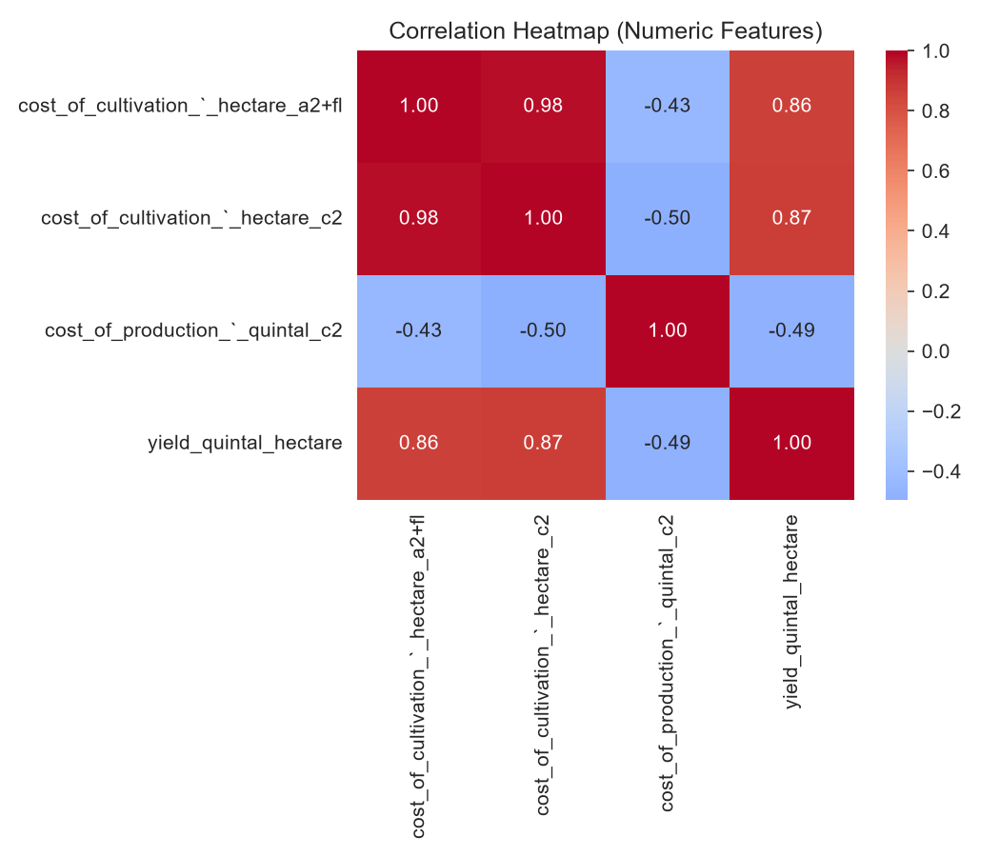
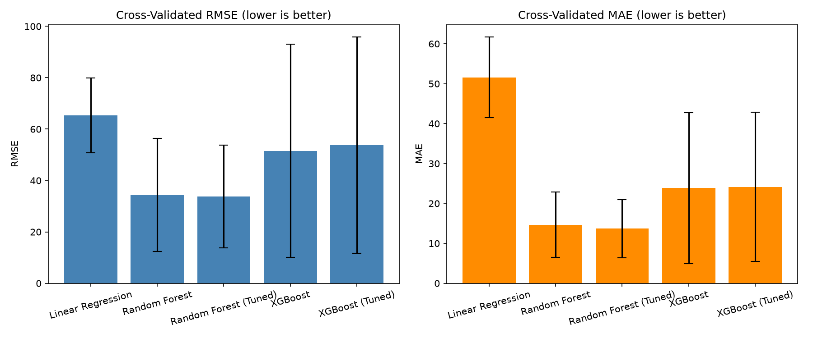
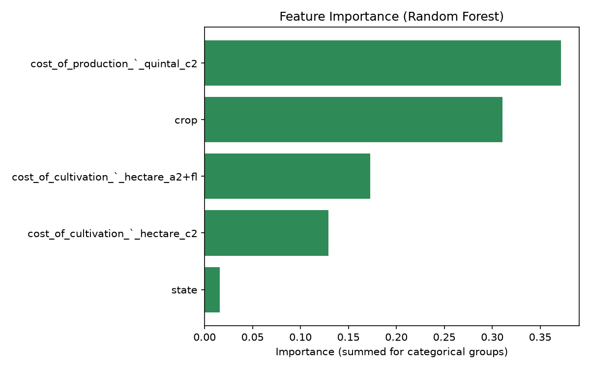
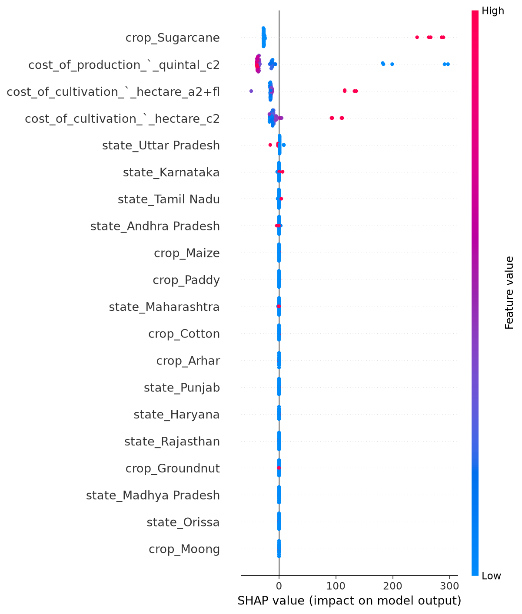

# Crop Yield Prediction in India


🔗 **[Live Demo](https://crop-yield-akshat.streamlit.app)** — Try the interactive prediction app

## Project Overview
This project predicts crop yield (Quintal/Hectare) across different crops and Indian states using machine learning, based on cultivation and production cost data. Built as part of a Machine Learning Internship project focused on solving real-world agricultural problems in India.

## Problem Statement
India's agricultural sector supports a large share of its population, yet farmers and policymakers often lack data-driven tools to estimate crop yield based on cultivation costs. This project builds a predictive model that estimates yield given the crop type, state, and cost of cultivation/production — helping identify which factors most influence yield.

## Project Structure
```
crop-yield-prediction/
├── src/
│   ├── preprocess.py    # Data cleaning
│   ├── eda.py           # Exploratory analysis
│   └── train_model.py   # Model training & evaluation
├── outputs/             # Charts and saved model
├── data/                # Raw and cleaned dataset
└── app.py               # Streamlit web app
```

## Dataset
- **Source:** Government of India agricultural cost and production dataset (data.gov.in)
- **Rows:** 49 (after cleaning)
- **Columns:**
  - `crop` — Crop name (e.g., Wheat, Rice, Maize, Sugarcane)
  - `state` — Indian state where the crop is grown
  - `cost_of_cultivation_hectare_a2fl` — Cost of cultivation (Rs/Hectare, A2+FL method)
  - `cost_of_cultivation_hectare_c2` — Cost of cultivation (Rs/Hectare, C2 method)
  - `cost_of_production_quintal_c2` — Cost of production (Rs/Quintal, C2 method)
  - `yield_quintal_hectare` — **Target variable**: Yield in Quintal/Hectare

## Approach

### 1. Data Cleaning (`src/preprocess.py`)
- Standardized column names and categorical text (Crop, State)
- Converted all numeric columns properly, handling missing/invalid values
- Removed duplicate rows
- Result: 49 clean rows, 0 missing values

### 2. Exploratory Data Analysis (`src/eda.py`)
Key findings:
- **Sugarcane has a dramatically higher yield** (700-1000+ Quintal/Hectare) compared to all other crops — a log-scale chart was used to visualize all crops fairly
- **Tamil Nadu, Karnataka, and Maharashtra** show the highest average yields, largely influenced by sugarcane cultivation
- **Strong positive correlation (0.87)** between Cost of Cultivation (C2) and Yield
- **Negative correlation (-0.49)** between Cost of Production per Quintal and Yield




### 3. Model Training (`src/train_model.py`)
Four models trained and evaluated using **5-fold cross-validation** (more reliable than a single train-test split on a 49-row dataset):

| Model | RMSE | MAE | R² | R² Std Dev |
|---|---|---|---|---|
| Linear Regression | 65.35 | 51.60 | -29.57 | 61.03 |
| Random Forest | 34.37 | 14.65 | 0.959 | 0.032 |
| **Random Forest (Tuned)** | **33.73** | **13.69** | **0.962** | **0.027** |
| XGBoost | 51.53 | 23.84 | 0.468 | 0.925 |
| XGBoost (Tuned) | 53.78 | 24.17 | 0.584 | 0.682 |

**Why cross-validation mattered:** An initial single train-test split made Linear Regression look competitive (R² = 0.949). 5-fold cross-validation revealed the truth: its R² is actually **-29.57 on average** with enormous variance — showing that small datasets can give misleadingly optimistic results with a single split.

**Random Forest is the clear winner** — best performance (lowest RMSE/MAE) and highest stability (lowest std dev across folds). XGBoost underperforms because it needs more data than this 49-row dataset provides. GridSearchCV was applied to XGBoost too (testing n_estimators, max_depth, learning_rate) but only improved MAE marginally, confirming Random Forest as the right choice.

**Best hyperparameters:** `n_estimators=100`, `max_depth=10`



### 4. Feature Importance & SHAP Analysis



Random Forest feature importance ranking:
1. **Cost of Production (per Quintal)** — most important
2. **Crop type** — second most important
3. **Cost of Cultivation (A2+FL & C2)**
4. **State** — least important

**Key insight:** Yield is primarily driven by *which crop* is grown and *how much it costs* to produce — not by *which state* it is grown in.

SHAP analysis for a more precise per-feature view:



- **`crop_Sugarcane` is the single most influential feature** — pushes predicted yield up by 200-300+ quintal/hectare
- **Cost of Production has the most balanced impact** — pushes predictions both up and down, making it the most informative continuous feature
- **Individual state features cluster near zero** — confirming state has minimal influence once crop and cost are accounted for

### 5. Interactive Prediction App (`app.py`)
A Streamlit web app with three tabs:

- **Predict Yield** — Select crop and state, enter costs, get instant prediction with:
  - **SHAP explanation** ("Why this prediction?") showing top 3 factors driving each individual prediction
  - **Live what-if sliders** — prediction updates instantly as cost inputs change, no button click needed
  - Extrapolation warning for unseen crop-state combinations

- **Recommend Crop** — Reverse lookup: enter state + budget → app ranks all crops by predicted yield with interactive bar chart

- **Data Insights** — All EDA and model evaluation charts as interactive Plotly visuals (zoom, hover, filter). Includes a live model comparison table with the best model auto-highlighted.

## Tech Stack
Python, pandas, numpy, scikit-learn, XGBoost, SHAP, Streamlit, matplotlib, seaborn, plotly

## How to Run
```bash
# 1. Clean the data
python src/preprocess.py --input "data/datafile (1).csv" --output "data/cleaned_crop_data.csv"

# 2. Run exploratory data analysis
python src/eda.py --input data/cleaned_crop_data.csv --outdir outputs

# 3. Train and evaluate models
python src/train_model.py --input data/cleaned_crop_data.csv --outdir outputs

# 4. Launch the interactive prediction app
streamlit run app.py
```

## Limitations
- Small dataset (49 rows) limits statistical robustness
- Does not account for external factors like rainfall, soil quality, or irrigation access
- State-wise sample sizes are uneven, which may bias average comparisons

## Future Improvements
- **Multi-year time series analysis** — Blocked until a dataset with a `year` column is available; would enable year-over-year yield trend visualization by crop/state
- **Incorporate rainfall and soil quality data** — External factors not currently in the model; likely to improve accuracy significantly
- **Prediction confidence intervals** — Currently gives single-point estimates; could use quantile regression or bootstrapped Random Forest predictions
- **Expand dataset size** — 49 rows is small for ML; more state/crop/year combinations would improve robustness

## Author
Akshat Chauhan — built as part of a 3rd-year B.Tech CSE ML internship project.
